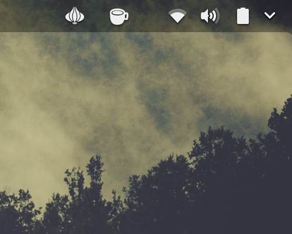

# torshell
Easy and convenient way to anonymize your web traffic in your linux box. (Gnome Shell Extension)

## USAGE
Once installed there will be an onion icon like this one on the Top Bar of Gnome.


This icon shows you if you're running anonymously trought TOR network or not, and let you toggle the status by just clicking on it. 



Thats it!

## PREREQUISITES
* Tor package that comes with your distro
* Wget and unzip to run the installer

## INSTALATION

As regular user run:

```
curl https://raw.githubusercontent.com/rramirezacosta/torshell/master/install.sh | bash
```

You may have to reload Gnome-Shell in order to appy the changes.

